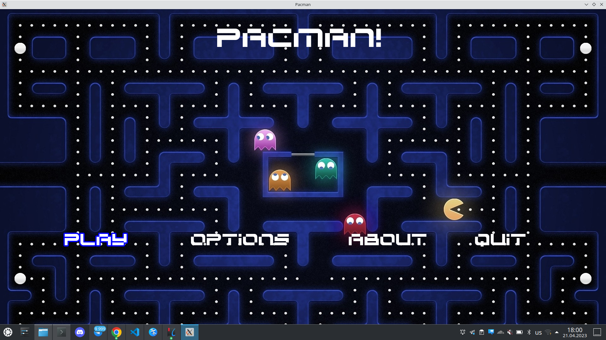
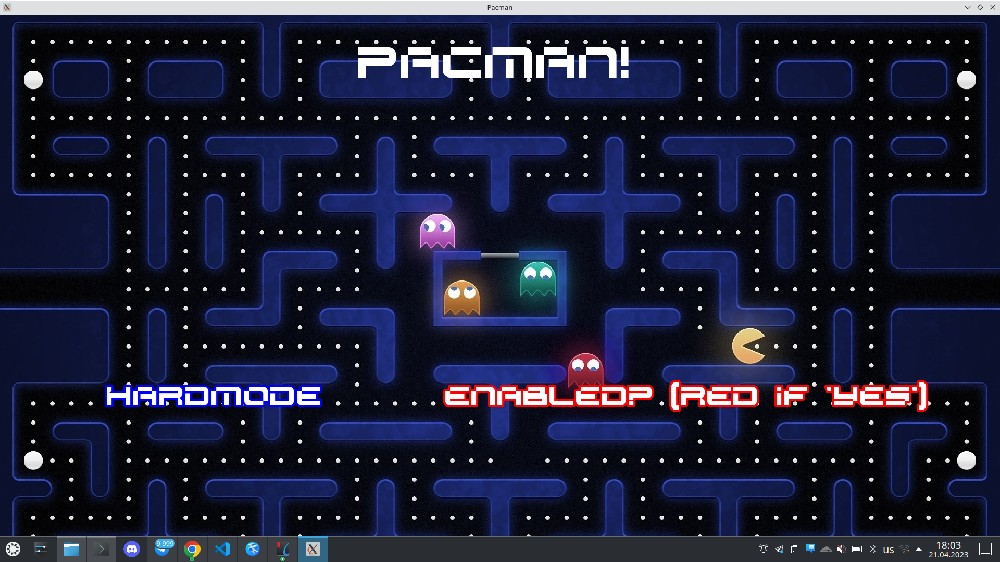
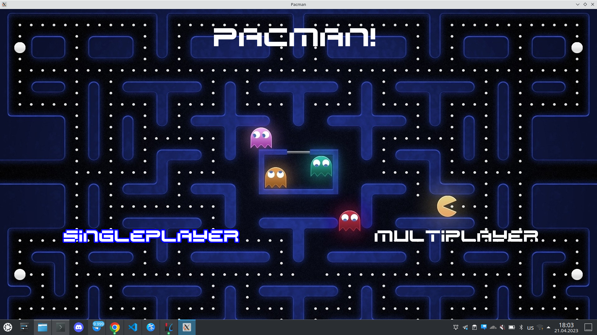
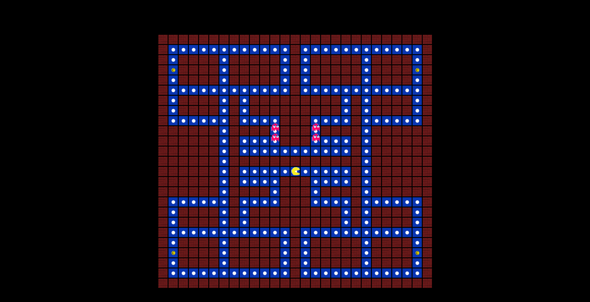

# Programming Technologies


## Theme: Pacman


## Table of Contents
- [Installation and Quick Start](https://github.com/VaganovAlexanderMih/TP2023_Pacman/tree/dev/GameFolder#installation-and-quick-start)
  - [Installation](https://github.com/VaganovAlexanderMih/TP2023_Pacman/tree/dev/GameFolder#installation)
  - [Quick Start](https://github.com/VaganovAlexanderMih/TP2023_Pacman/tree/dev/GameFolder#quick-start)
- [Images of gameplay](https://github.com/VaganovAlexanderMih/TP2023_Pacman/tree/dev/GameFolder#images-of-gameplay)
- [Contributors](https://github.com/VaganovAlexanderMih/TP2023_Pacman/tree/dev/GameFolder#contributors)`


## Installation and Quick Start

### Installation

```
git clone --branch dev git@github.com:VaganovAlexanderMih/TP2023_Pacman.git PacManGame
cd PacManGame
cd GameFolder
chmod +x install.sh
./install.sh
```

If you want to launch the game, just run next command:

```
./run.sh
```

### Quick Start
- \(Optional) If you want to play on HardMode, then go to the "Settings" option
  and choose the "HardMode" option (If chosen, it'll be red, if not - green)
- In the main menu choose the "Play" option
- Then choose the gameplay mode(SinglePlayer or MultiPlayer)
- Play)
- To win you have to collect all the cherries and not to be catched by the
  ghosts.
- Good luck!

## Images of gameplay:

Main menu:



Hardmode option:



Gameplay choose:



Game:




## Contributors:

[Vaganov Alexander B05-220](https://t.me/FogInTheHedgehod), [Sidletskiy Pavel B05-220](https://t.me/vendor_vachupa)
